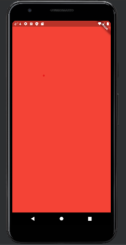
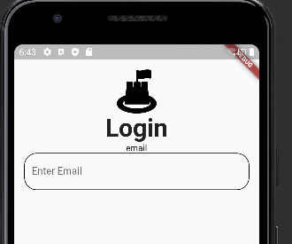

# flutter_login

### 1. 의존성 추가하기
- [pub.dev](pub.dev) 에 접속한다.
- flutter svg를 검색하면 flutter_svg라이브러리를 클릭하고 아래의 순서대로 의존성을 복사한다.


- 복사한 후에 pubspec.yaml의 dependencies 부분에 아래와 같이 붙여넣는다.
```yaml
dependencies:
  flutter:
    sdk: flutter
  flutter_svg: ^0.22.0
```
- pub get 을 누르고, dependency를 불러오면 끝!
---
### 2. routes 적용하기
```dart
  @override
  Widget build(BuildContext context) {
    return MaterialApp(
      initialRoute: "/login",
      routes: {
        "/login": (context) => LoginPage(),
        "/home" : (context) => HomePage()
      },
    );
  }
```

- initialRoute 에 입력한 문자열에 따라 페이지가 변하게 된다.



- home으로 설정


- /login으로 설정

### 3. Text 추가 후 클래스로 추출하기
- ListView를 Column으로 바꾼 후에 Text를 추가하였다.
- Column위에서 ctrl+w를 누르고 마우스 우클릭 - refactor - extract Flutter Widget 을 선택한다.
- 추출되는 클래스를 Logo.dart에 옮긴다.
- 이렇게 하면 재사용하기에 용이하다.

### 4. TextFormField 디자인하기
- 컴포넌트 디렉토리에 custom_text_form_field 다트 파일을 만든다.
- login_page의 Column에 CustomTextFormField를 추가한다.
- CustomTextFormField에 위에 들어갈 Text위젯과 TextFormField 위젯을 추가한다.
- TextFormField에는 enabledBorder와 focusedBorder속성을 추가한다.
- 
```dart
class CustomTextFormField extends StatelessWidget {
    final String text;
    
    const CustomTextFormField({required this.text});
```
- 추상화를 하기 위해 필드를 추가하고 생성자를 만든다.

### 5. TextButton 테마 적용 - styleFrom
- main.dart에 아래와 같은 코드를 입력한다.
```dart
theme: ThemeData(
    textButtonTheme: TextButtonThemeData(
          style: TextButton.styleFrom(
          backgroundColor: Colors.black,
          primary: Colors.white,
          shape: RoundedRectangleBorder(
          borderRadius: BorderRadius.circular(30),
          ),
          minimumSize: Size(400, 60),
        ),
    ),
), 
```
- .style을 이용할 수도 있지만 styleFrom을 이용하면 훨씬 적은 코드로 테마를 적용할 수 있다.
- primary는 프로젝트의 대표 색상이다.

