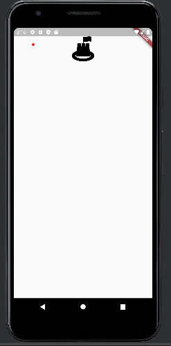

# flutter_login

### 1. 의존성 추가하기
- [pub.dev](pub.dev) 에 접속한다.
- flutter svg를 검색하면 flutter_svg라이브러리를 클릭하고 아래의 순서대로 의존성을 복사한다.


- 복사한 후에 pubspec.yaml의 dependencies 부분에 아래와 같이 붙여넣는다.
```yaml
dependencies:
  flutter:
    sdk: flutter
  flutter_svg: ^0.22.0
```
- pub get 을 누르고, dependency를 불러오면 끝!
---
### 2. routes 적용하기
```dart
  @override
  Widget build(BuildContext context) {
    return MaterialApp(
      initialRoute: "/login",
      routes: {
        "/login": (context) => LoginPage(),
        "/home" : (context) => HomePage()
      },
    );
  }
```

- initialRoute 에 입력한 문자열에 따라 페이지가 변하게 된다.


- home으로 설정


- /login으로 설정

